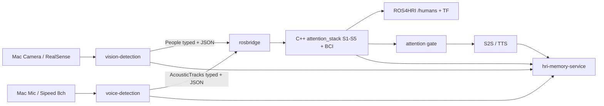
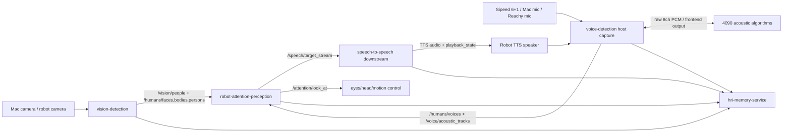
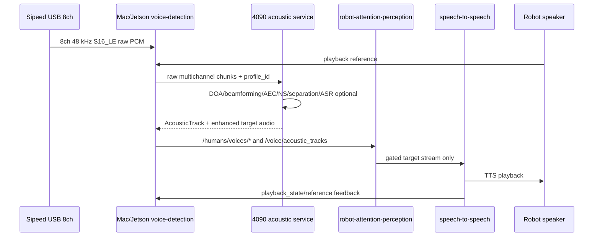
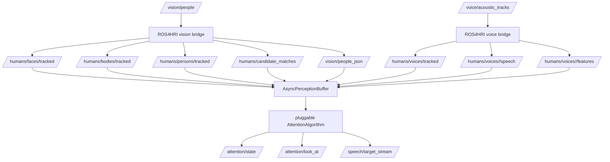
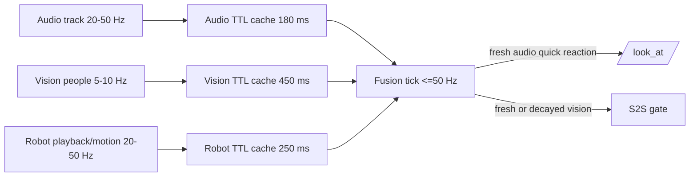
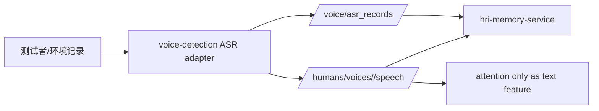

# 架构图与数据链路

## Mac + Docker 首测

Mac 原生进程负责 CoreAudio/AVFoundation 采集，Docker Desktop 运行 ROS2 Humble、ROS4HRI ingress 和 C++ attention。换 Jetson 后只迁移采集端，强类型 topic 与融合算法不变。

## 四系统总图

## 声学内部回路

这个回路是正常的：上位机离 USB 硬件近，4090 离重模型近。不要用 QuickTime/系统录音替代 host capture，因为它们通常拿不到原始 8ch。

## ROS4HRI 数据链路

当前实现提供两条联调路径：

- 轻量 JSONL：`attention_json_bridge.py` 直接读 vision/acoustic/robot 事件，适合无 ROS2 的 Mac 仿真和回归测试。
- ROS2 bridge：`ros4hri_vision_bridge.py`、`ros4hri_voice_bridge.py`、`ros4hri_attention_node.py` 把工程 topic 转成 ROS4HRI 风格 topic，再进入 attention gate。

## 频率不一致的融合

核心规则：

- 不阻塞等待视觉；音频先触发转头。
- 视觉过期不是瞬间失效，而是 gaze/facing/confidence 降权。
- 声学过期很快丢弃，防止机器人追着旧声音。
- 机器人正在播放且 self-echo 高的 track 直接拒绝，防止自说自听。

## ASR 测试数据链路

ASR 测试只记录文字、语言/清晰度、差异和时延，不在 ASR 层判断意图、权限、是否该回应。
